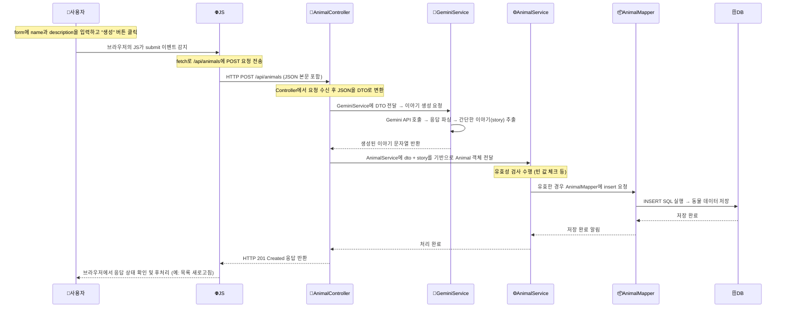
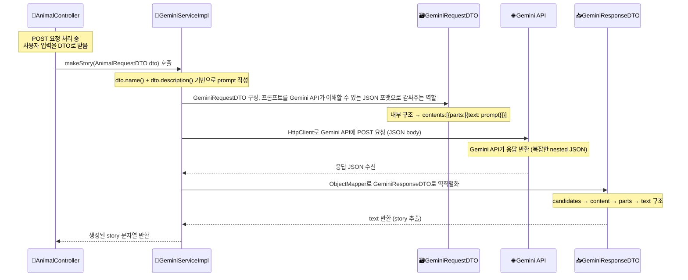

### Diagram



### 각 파일 역할 정리

**📁 index.html**

- 사용자와 상호작용하는 프론트엔드 UI
- 사용자가 이름과 설명을 입력할 수 있는 form을 제공함
- JavaScript 코드로 submit 이벤트를 감지하고, 서버에 JSON 데이터를 fetch API로 전송함
- 페이지가 로드될 때 기존 동물 리스트를 서버에서 가져와서 표시함

**📁 controller/AnimalController.java**

- 백엔드의 입구 역할을 하는 클래스 (REST API Controller)
- POST 요청을 받아서 JSON을 DTO로 변환하고 서비스 계층에 전달
- GeminiService를 호출해서 이야기를 생성하고, 이야기와 DTO를 합친 객체를 만들어 서비스 계층에 Animal 객체 전달
- 서비스 ~ Mapper를 거쳐 DB 저장 후에는 상태 코드만 반환함
- GET 요청도 처리하여 등록된 동물 전체 리스트를 반환함

**📁 controller/MainController.java**

- 루트 URL(/)로 접속했을 때 index.html을 반환하는 간단한 웹 페이지 진입 컨트롤러
- REST가 아닌 일반 템플릿용 컨트롤러로 사용됨

**📁 dto/AnimalRequestDTO.java**

- 클라이언트가 보낸 JSON 데이터를 자바 객체로 매핑하기 위한 DTO 클래스
- DTO는 Controller에서만 사용되고, 이후 내부에서 사용되는 Entity로 변환함
- 이 DTO는 별도의 변환 메서드(toAnimal)를 가지고 있어서, 받은 입력값과 생성된 이야기를 기반으로 Animal 객체(Entity)를 생성함

**📁 dto/GeminiRequestDTO.java, GeminiResponseDTO.java**

- 이 두 DTO 클래스는 Google Gemini API와의 통신을 위해 만들어졌으며, 요청과 응답의 복잡한 JSON 구조를 **자바**로 표현하기 위해 설계되었습니다.
- GeminiRequestDTO는 GeminiAPI에 보낼 prompt 데이터를 감싼 구조로,

contents: [{ parts: [{ text: \"...\" }] }]

- 이 구조를 맞추기 위해 내부에 Content, Part라는 중첩된 record 클래스를 사용합니다.

- 사용자의 입력값 (name, description)을 기반으로 만들어진 하나의 문장을 text로 구성하여 전달합니다.
- GeminiResponseDTO는 응답을 파싱하기 위한 구조로, 응답 형태인 candidates → content → parts → text 구조를 그대로 반영하여 중첩된 record로 구성합니다.
- Jackson 라이브러리로 역직렬화를 수행할 때, 예상하지 못한 필드로 인해 오류가 발생하지 않도록 @JsonIgnoreProperties(ignoreUnknown = true)를 통해 방어적으로 설계되어 있습니다.
- 이 DTO들은 단순한 데이터 전달이 아니라, 외부 API와 정확히 계약을 맞춰주는 인터페이스 역할을 하며, 내부적으로는 Service 단에서 .candidates().get(0).content().parts().get(0).text() 같은 방식으로 story 텍스트를 쉽게 추출할 수 있게 돕습니다.

**📁 domain/Animal.java**

- 실제 DB 테이블과 1:1로 매핑되는 Entity 클래스
- DB의 uuid, name, description, story, createdAt과 필드 구조가 동일함

**📁 mapper/AnimalMapper.java**  

- MyBatis Mapper 인터페이스
- @Insert, @Select 등의 어노테이션 기반으로 SQL을 직접 기술함
- findAll() 메서드는 전체 리스트를 조회하며, insert()는 새로운 동물 데이터를 DB에 삽입함

**📁 service/AnimalService.java (interface) & AnimalServiceImpl.java**

- Animal 데이터를 저장하거나 조회하는 비즈니스 로직 담당 계층
- 입력값이 비어 있는지 등 유효성 검사를 수행하고, 유효할 경우 Mapper로 위임함
- GET 요청 시에는 Mapper를 통해 DB에서 모든 Animal을 조회해서 반환함

**📁 service/GeminiService.java & GeminiServiceImpl.java**

- Gemini API를 호출해 사용자가 작성한 이름/설명을 기반으로 이야기를 생성하는 기능 담당
- Prompt를 만들어 Google API에 요청을 보낸 뒤, story만 추출해서 반환함
- 내부에서 Java 11의 HttpClient와 ObjectMapper를 활용함

---
### GeminiServiceImpl 기반 전체 흐름 다이어그램



---

### index.html (중에서 비동기 이벤트 기반 구조 분석)

```js
1. animalForm.addEventListener('submit', async (event) => { ... });
2. document.addEventListener('DOMContentLoaded', async () => { ... });
```
- 모두 addEventListener()라는 함수로 "어떤 일이 발생했을 때" 실행할 코드를 등록하는 구조예요.
- 안쪽에서 async () => { ... }는 비동기 함수에요.
- 그 안에서 await fetch(...)가 서버랑 통신하는 코드예요.


### 용어 정리

개념 | 의미
---  | ---
addEventListener | 특정 DOM 요소에 이벤트(클릭, 제출, 로딩 등)가 발생했을 때 실행할 코드를 등록함
'submit' | 폼에서 "제출"될 때 발생하는 이벤트 (버튼 누르거나 Enter)
'DOMContentLoaded' | HTML 문서가 처음 완전히 로드되었을 때 발생하는 이벤트
async | "이 함수는 비동기적으로 작동해!" → 안에서 await를 쓸 수 있음
event | 사용자의 동작에 대한 정보가 담긴 객체 (event.preventDefault() 이런 거 가능)
await | "이 작업이 끝날 때까지 기다려줘" → Promise가 끝날 때까지 대기
fetch | JS에서 HTTP 요청을 보내는 기본 함수 (GET, POST 등 가능)
response | fetch로 요청한 결과값 (응답 본문, 상태코드 등)
JSON.stringify() | JS 객체 → JSON 문자열로 바꾸는 함수

### index.html 일부 코드를 조각별로 설명

```js
animalForm.addEventListener('submit', async (event) => {
```
- animalForm에 "submit" 이벤트가 생기면
- async로 정의된 익명 함수가 실행됨

```js
async (event) => {
    event.preventDefault(); // 기본 제출 동작 막기 (새로고침 방지)
    ...
}
```
- async → 이 함수는 await를 쓸 수 있어요
- event → 사용자가 form을 어떻게 제출했는지 정보가 들어있어요
- preventDefault() → 브라우저 기본 동작 막기

```js
const response = await fetch('/api/animals', {
    method: 'POST',
    headers: { 'Content-Type': 'application/json' },
    body: JSON.stringify({ name, description })
});
```
- 서버에 POST 요청 보냄
- await → 응답이 올 때까지 기다림
- response → 서버에서 받은 응답 전체

```js
document.addEventListener('DOMContentLoaded', async () => {
```
- "HTML 다 뜨면 아래 코드 실행해줘"
- document → 현재 웹페이지 전체
- 'DOMContentLoaded' → HTML이 다 파싱되었을 때 발생하는 이벤트
- addEventListener() → 그 이벤트가 발생하면 함수를 실행해줘
- async () => {} → 실행할 함수인데, 비동기 함수 (await 쓸 수 있음)

```js
const response = await fetch('/api/animals');
```
- "서버야, 동물 목록 좀 줘봐 → 올 때까지 기다릴게"
- 서버로 GET 요청을 보냄
- /api/animals → 등록된 동물 목록을 가져오는 주소
- await → 응답이 돌아올 때까지 기다림
- response → 응답 전체가 담긴 객체 (status, body, headers 등 포함)

```js
const json = await response.json();
```
- "서버가 준 데이터를 JSON 형태로 바꿔줘"
- 응답 내용을 JSON 데이터로 변환
- response.json() → 본문을 파싱해 실제 데이터로 꺼냄
- 다시 await → JSON으로 바꾸는 것도 시간이 걸릴 수 있으니까 기다려줌

```js
document.querySelector('#animal-list').innerHTML = JSON.stringify(json);
```
- "가져온 동물 목록을 화면에 보여줘 (일단 텍스트 형태로)"
- #animal-list라는 ID를 가진 요소 찾기
- 그 안에 내용을 json 데이터로 채워넣기
- JSON.stringify(json) → JS 객체를 문자열로 바꿔서 보기 좋게 출력

### 시각적으로 정리

```plaintext
[HTML 다 로드됨]
   ↓
[DOMContentLoaded 발생]
   ↓
[GET 요청 보냄] → /api/animals
   ↓
[서버 응답 받음 → 목록 표시]


[사용자가 form 제출]
   ↓
[submit 이벤트 발생]
   ↓
[event.preventDefault()] → 새로고침 막음
   ↓
[POST 요청 보냄] → /api/animals
   ↓
[응답 상태 확인] → 성공/실패 처리
```
