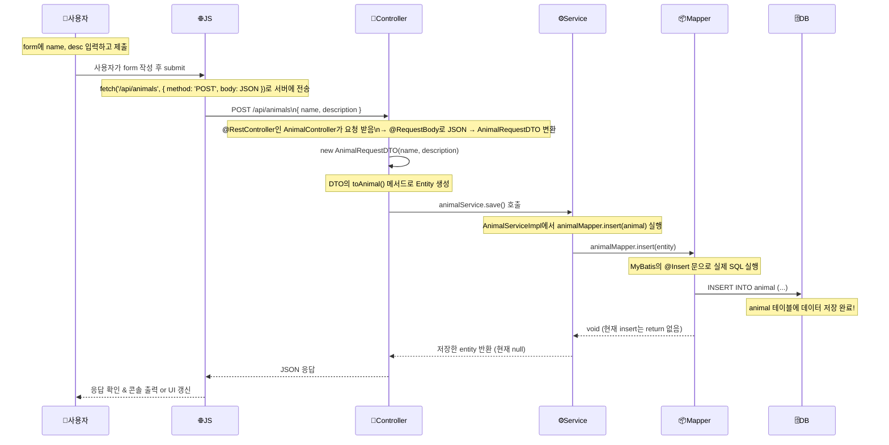

### Diagram

### 각 파일 역할 정리

계층 | 파일 | 역할 요약
🌍 HTML/JS | index.html | 사용자 입력 → fetch('/api/animals', { method: 'POST' })로 JSON 전송
🎯 Controller | AnimalController | REST API 진입 지점. @PostMapping으로 요청 받음 → DTO → Entity 변환 후 Service에 전달
🧠 DTO | AnimalRequestDTO | 클라이언트가 보낸 JSON 데이터를 객체로 받기 위한 형식. toAnimal()로 Entity 변환 지원
⚙️ Service | AnimalService, AnimalServiceImpl | 비즈니스 로직 담당. 현재는 insert만 있고, AI story는 아직 빈값
🧩 Mapper (MyBatis) | AnimalMapper | DB 접근 담당. SQL 직접 작성. @Insert로 animal 테이블에 저장
🗃️ 도메인 객체 | Animal | DB 테이블과 거의 1:1로 매핑되는 불변 객체 (record 사용)
