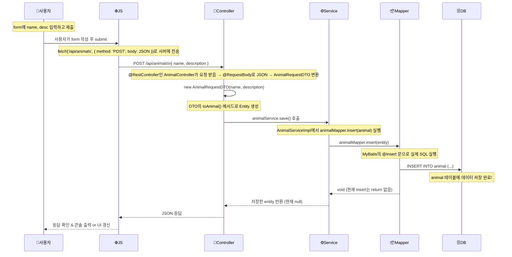

### Diagram



### 각 파일 역할 정리

계층 | 파일 | 역할 요약
---- | ---- | --------
🌍 HTML/JS | index.html | 사용자 입력 → fetch('/api/animals', { method: 'POST' })로 JSON 전송
🎯 Controller | AnimalController | REST API 진입 지점. @PostMapping으로 요청 받음 → DTO → Entity 변환 후 Service에 전달
🧠 DTO | AnimalRequestDTO | 클라이언트가 보낸 JSON 데이터를 객체로 받기 위한 형식. toAnimal()로 Entity 변환 지원
⚙️ Service | AnimalService, AnimalServiceImpl | 비즈니스 로직 담당. 현재는 insert만 있고, AI story는 아직 빈값
🧩 Mapper (MyBatis) | AnimalMapper | DB 접근 담당. SQL 직접 작성. @Insert로 animal 테이블에 저장
🗃️ 도메인 객체 | Animal | DB 테이블과 거의 1:1로 매핑되는 불변 객체 (record 사용)


---

### index.html (중에서 비동기 이벤트 기반 구조 분석)

```js
1. animalForm.addEventListener('submit', async (event) => { ... });
2. document.addEventListener('DOMContentLoaded', async () => { ... });
```
- 모두 addEventListener()라는 함수로 "어떤 일이 발생했을 때" 실행할 코드를 등록하는 구조예요.
- 안쪽에서 async () => { ... }는 비동기 함수에요.
- 그 안에서 await fetch(...)가 서버랑 통신하는 코드예요.


#### 용어 정리

개념 | 의미
---  | ---
addEventListener | 특정 DOM 요소에 이벤트(클릭, 제출, 로딩 등)가 발생했을 때 실행할 코드를 등록함
'submit' | 폼에서 "제출"될 때 발생하는 이벤트 (버튼 누르거나 Enter)
'DOMContentLoaded' | HTML 문서가 처음 완전히 로드되었을 때 발생하는 이벤트
async | "이 함수는 비동기적으로 작동해!" → 안에서 await를 쓸 수 있음
event | 사용자의 동작에 대한 정보가 담긴 객체 (event.preventDefault() 이런 거 가능)
await | "이 작업이 끝날 때까지 기다려줘" → Promise가 끝날 때까지 대기
fetch | JS에서 HTTP 요청을 보내는 기본 함수 (GET, POST 등 가능)
response | fetch로 요청한 결과값 (응답 본문, 상태코드 등)
JSON.stringify() | JS 객체 → JSON 문자열로 바꾸는 함수

#### index.html 일부 코드를 조각별로 설명

```js
animalForm.addEventListener('submit', async (event) => {
```
- animalForm에 "submit" 이벤트가 생기면
- async로 정의된 익명 함수가 실행됨

```js
async (event) => {
    event.preventDefault(); // 기본 제출 동작 막기 (새로고침 방지)
    ...
}
```
- async → 이 함수는 await를 쓸 수 있어요
- event → 사용자가 form을 어떻게 제출했는지 정보가 들어있어요
- preventDefault() → 브라우저 기본 동작 막기

```js
const response = await fetch('/api/animals', {
    method: 'POST',
    headers: { 'Content-Type': 'application/json' },
    body: JSON.stringify({ name, description })
});
```
- 서버에 POST 요청 보냄
- await → 응답이 올 때까지 기다림
- response → 서버에서 받은 응답 전체

```js
document.addEventListener('DOMContentLoaded', async () => {
```
- "HTML 다 뜨면 아래 코드 실행해줘"
- document → 현재 웹페이지 전체
- 'DOMContentLoaded' → HTML이 다 파싱되었을 때 발생하는 이벤트
- addEventListener() → 그 이벤트가 발생하면 함수를 실행해줘
- async () => {} → 실행할 함수인데, 비동기 함수 (await 쓸 수 있음)

```js
const response = await fetch('/api/animals');
```
- "서버야, 동물 목록 좀 줘봐 → 올 때까지 기다릴게"
- 서버로 GET 요청을 보냄
- /api/animals → 등록된 동물 목록을 가져오는 주소
- await → 응답이 돌아올 때까지 기다림
- response → 응답 전체가 담긴 객체 (status, body, headers 등 포함)

```js
const json = await response.json();
```
- "서버가 준 데이터를 JSON 형태로 바꿔줘"
- 응답 내용을 JSON 데이터로 변환
- response.json() → 본문을 파싱해 실제 데이터로 꺼냄
- 다시 await → JSON으로 바꾸는 것도 시간이 걸릴 수 있으니까 기다려줌

```js
document.querySelector('#animal-list').innerHTML = JSON.stringify(json);
```
- "가져온 동물 목록을 화면에 보여줘 (일단 텍스트 형태로)"
- #animal-list라는 ID를 가진 요소 찾기
- 그 안에 내용을 json 데이터로 채워넣기
- JSON.stringify(json) → JS 객체를 문자열로 바꿔서 보기 좋게 출력

#### 시각적으로 정리

```plaintext
[HTML 다 로드됨]
   ↓
[DOMContentLoaded 발생]
   ↓
[GET 요청 보냄] → /api/animals
   ↓
[서버 응답 받음 → 목록 표시]


[사용자가 form 제출]
   ↓
[submit 이벤트 발생]
   ↓
[event.preventDefault()] → 새로고침 막음
   ↓
[POST 요청 보냄] → /api/animals
   ↓
[응답 상태 확인] → 성공/실패 처리
```
